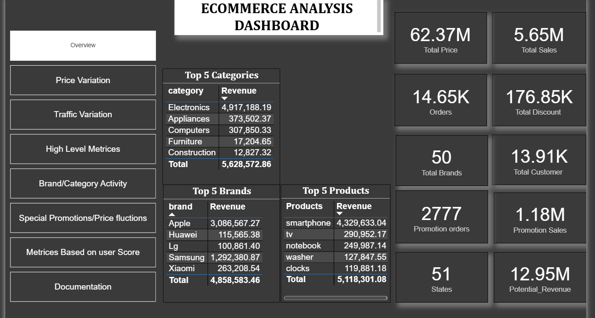

<div align="center">

# 🛒 E-Commerce Customer Behavior Analytics
### A Power BI Case Study on Pricing, Promotions & Traffic Patterns


-blue?style=for-the-badge)


*An end-to-end analytics case study built for a leading e-commerce client — turning ~2 months of raw clickstream data into an interactive Power BI dashboard covering KPIs, pricing, promotions, traffic, and customer segmentation.*

</div>

---

## 📋 Table of Contents

- [Project Overview](#-project-overview)
- [Business Case](#-business-case)
- [Key Business Questions](#-key-business-questions)
- [Project Structure](#-project-structure)
- [Data Dictionary](#-data-dictionary)
- [Data Cleaning & Preparation](#-data-cleaning--preparation)
- [Dashboard Walkthrough & Insights](#-dashboard-walkthrough--insights)
  - [1. Overview](#1-overview)
  - [2. Traffic Variation by Day, Time & Channel](#2-traffic-variation-by-day-time--channel)
  - [3. Hourly Traffic over Channels](#3-hourly-traffic-over-channels)
  - [4. Brand & Category Activity](#4-brand--category-activity)
  - [5. Effect of Special Promotions & Price Fluctuations](#5-effect-of-special-promotions--price-fluctuations)
  - [6. Metrics Based on User Score](#6-metrics-based-on-user-score)
  - [7. Price Variation (Referenced)](#7-price-variation-referenced)
  - [8. High Level Metrics (Referenced)](#8-high-level-metrics-referenced)
- [Case Study Deliverable Questions](#-case-study-deliverable-questions)
- [Executive Summary of Insights](#-executive-summary-of-insights)
- [Tools & Tech Stack](#-tools--tech-stack)
- [Getting Started](#-getting-started)
- [Future Enhancements](#-future-enhancements)
- [Author](#-author)
- [License](#-license)

---

## 🎯 Project Overview

This repository contains a complete Power BI case study built for a leading e-commerce client. The goal was to take ~2 months of raw customer clickstream data (views, cart adds, purchases) alongside a special-promotions dataset, clean and model it, and produce an interactive dashboard that answers real business questions around **pricing, promotions, traffic, and customer/brand behavior** — along with a written analysis of the insights.

**Deliverables:**
1. 📊 An interactive Power BI dashboard (`.pbix`)
2. 📝 A written document summarizing insights, audience, value, and data gaps (this README + `business problem/PowerBI Case Study.pdf`)

---

## 🧠 Business Case

> As an analyst working for a leading e-commerce client, the objective is to build analytical dashboards across three core themes:
>
> - **Overview** of various KPIs
> - **Pricing & Promotion**
> - **Search & Recommendations**
>
> The data covers multiple user events (view → cart → purchase) over a **two-month window**, alongside a limited dataset of special, first-page promotions run on individual products.

The raw data required cleaning before analysis, and the case study asks four documentation questions that this README answers in detail below:

| # | Question |
|---|----------|
| a | What variables can be derived from the data that are helpful for analysis? |
| b | Who can use this dashboard? |
| c | What value does this dashboard generate? |
| d | What additional data would add more insight/value? |

---

## ❓ Key Business Questions

The dashboard was designed to answer the following (non-exhaustive) set of questions:

- How does price vary by brand, category, time, and channel?
- Does traffic vary by day of week, time of day, and channel (App vs. Browser)?
- What are the high-level KPIs — revenue, potential revenue, product/category counts — by month, time, state, and channel?
- What is brand/category activity, brand preference, and brand engagement across parameters?
- What does search behavior look like (brand search by category, category search by brand)?
- What effect do special promotions have on conversion and revenue?
- How do price fluctuations impact sales?

---

## 🗂️ Project Structure

```text
ecommerce_power_bi_case_study/
│
├── Assets/
│   ├── BrandCategory Activity.png
│   ├── high level metrices.png
│   ├── Metrices Based on user Score.png
│   ├── overview.png
│   ├── price variations.png
│   ├── Special PromotionsPrice fluctions.png
│   ├── traffic variations 2.png
│   └── traffic variations.png
│
├── business problem/
│   └── PowerBI Case Study.pdf        # Original client brief
│
├── dashboard/
│   └── Ecommerce Case Stusy.pbix     # Power BI source file
│
├── data/
│   ├── Promotion.csv.xlsx            # Special promotions dataset
│   └── Sales_Data_Ecommerce.csv      # Core clickstream dataset
│
└── README.md
```
---

## 📊 Data Dictionary

### 1. `Sales_Data_Ecommerce`
Core clickstream table — one row per user event.

| Field | Description |
|---|---|
| `user_id` | Unique ID of the customer |
| `event_date` / `event_time` / `event_hour` / `Day_of_Week` | Temporal breakdown of the event |
| `Channel` | App or Browser |
| `event_type` | Type of event: `view`, `cart`, `purchased` |
| `product_id` / `category_id` | Unique identifiers for products and categories |
| `category` / `sub_category1` / `sub_category2` | Category hierarchy |
| `brand` | Brand name |
| `price` | Price of the product at time of event |
| `user_session` | Unique ID of the user's session |
| `State` | Geographic state of the user |
| `User_Score` | Customer segmentation / scoring tier |

### 2. `Promotion`
Special, first-page product promotions (a subset of all promotions run by the client).

| Field | Description |
|---|---|
| `Promotion Id` | Promotion type identifier |
| `Date` | Date the promotion ran |
| `Discount` | Discount percentage applied |
| `ProductId` | Product that was promoted |

---

## 🧹 Data Cleaning & Preparation

Before modeling, the raw data was cleaned and shaped in Power Query / DAX:

- **Deduplication & null handling** across `user_id`, `product_id`, and `user_session`
- **Date/time engineering** — splitting `event_date`/`event_time` into `event_hour`, `Day_of_Week`, and `event_week` for time-based analysis
- **Join logic** — mapping `Promotion` to `Sales_Data_Ecommerce` on `ProductId` + `Date` to create a `Promotion_Status` flag (Promoted = 1 / Not Promoted = 0)
- **Derived pricing fields** — an *Effective Price* field (price net of promotional discount) to compare against list price
- **Funnel flags** — classifying each `event_type` into the View → Cart → Purchase funnel for conversion-rate analysis
- **Geo standardization** — normalizing `State` to standard 2-letter state codes for map/treemap visuals
- **Segmentation** — retaining `User_Score` as a categorical field (1–4) for cohort-style analysis

---

## 📈 Dashboard Walkthrough & Insights

### 1. Overview


The landing page surfaces the headline KPIs for the full 2-month period:

| Metric | Value |
|---|---|
| Total Price (list) | **62.37M** |
| Total Sales (Revenue) | **5.65M** |
| Orders | **14.65K** |
| Total Discount Given | **176.85K** |
| Total Brands | **50** |
| Total Customers | **13.91K** |
| Promotion Orders | **2,777** |
| Promotion Sales | **1.18M** |
| States Covered | **51** |
| Potential Revenue | **12.95M** |

**Top performers:**
- **Category:** Electronics dominates at **4.92M** revenue (~87% of the top-5 category total of 5.63M), far ahead of Appliances (373.5K) and Computers (307.9K).
- **Brand:** Apple leads with **3.09M**, followed by Samsung (1.29M) and Xiaomi (263K).
- **Product:** *Smartphone* alone drives **4.33M** — the single largest product line by far, followed by TV (291K) and notebook (250K).

> 🔎 **Insight:** Realized revenue (5.65M) is less than half of Potential Revenue (12.95M) and far below Total Price (62.37M) — indicating significant drop-off between browsing and purchase, and headroom for conversion-focused initiatives.

---

### 2. Traffic Variation by Day, Time & Channel


Session counts (`user_session`) split by `Day_of_Week` and `Channel`:

| Day | App | Browser |
|---|---|---|
| Friday | 14.1K | 13.8K |
| Saturday | 13.7K | 13.8K |
| Sunday | 13.0K | 13.2K |
| Thursday | 10.3K | 10.6K |
| Tuesday | 9.7K | 9.5K |
| Wednesday | 9.5K | 9.6K |
| Monday | 8.9K | 9.1K |

> 🔎 **Insight:** Traffic peaks Friday–Sunday and is noticeably lower Monday–Wednesday — a ~35–58% lift on weekends versus the quietest weekday (Monday). App and Browser volumes are nearly balanced, with Browser slightly ahead on lower-traffic days.

---

### 3. Hourly Traffic over Channels


- Traffic bottoms out overnight (**~0.4K–0.9K** sessions between midnight and 3 AM)
- Ramps sharply from 4 AM onward
- Peaks in the **early-to-mid afternoon (hours 14–17)** at **~5.1K–5.2K** sessions
- Gradually tapers off through the evening

> 🔎 **Insight:** App and Browser traffic move almost in lockstep hour-by-hour — this is a single, unified customer base rather than two distinct usage patterns, which simplifies infrastructure/staffing planning around the 2–5 PM peak window.

---

### 4. Brand & Category Activity


- **Brand activity by day** mirrors the overall weekly traffic pattern — Friday highest (28.06K), Monday lowest (18.13K).
- **Category activity by `event_week`** trends downward across the observed window, from 35.16K in the earliest week to 9.39K in the latest — worth investigating whether this reflects a genuine demand decline, a partial/incomplete final week of data, or a seasonal effect.
- **Brand preference (by view volume):** Samsung leads at **36.98K**, ahead of Apple (28.66K) and Xiaomi (19.62K).
- **Revenue by brand:** Apple leads at **3.09M** despite trailing Samsung in views — implying a materially higher conversion rate and/or average selling price per view for Apple products.

> 🔎 **Insight:** The brand most *browsed* (Samsung) is not the brand generating the most *revenue* (Apple). This view-vs-revenue gap is a strong signal for pricing/merchandising teams to investigate Apple's funnel efficiency and consider applying similar tactics to Samsung listings.

---

### 5. Effect of Special Promotions & Price Fluctuations


**Conversion funnel — Promoted vs. Non-promoted products:**

| Stage | Promoted | Non-Promoted |
|---|---|---|
| View | 13.58K | 112.35K |
| Cart | 3.73K | 15.70K |
| Purchase | 2.78K | 11.87K |
| **View→Purchase rate** | **20.5%** | **10.6%** |

**Revenue split by promotion status:** Promoted = **1.18M (20.96%)** vs. Non-Promoted = **4.47M (79.04%)**.

**Price vs. Sales trend (Oct–Nov 2019):** a sharp, short-lived spike in both list price and effective price in early November lines up with a visible bump in revenue — evidence of a specific pricing/promotional event driving a temporary demand surge.

**Revenue by weekday** follows the same shape whether promoted or not — **Sunday is the strongest day** (245.9K promoted / 960.2K non-promoted) and **Monday the weakest** (140.1K / 516.2K).

> 🔎 **Insight:** Promoted products convert at **~2x the rate** of non-promoted products (20.5% vs. 10.6%), even though they represent a small share of total views. This is one of the strongest levers in the dataset — scaling promotion coverage (currently ~2,777 of 14.65K orders, ~19%) could meaningfully lift overall conversion if margins support it.

---

### 6. Metrics Based on User Score


| User Score | Revenue | Customer Count | Share |
|---|---|---|---|
| 3 | 1,428K | 36.12K | 25.02% |
| 4 | 1,425K | 36.40K | 25.22% |
| 1 | 1,408K | 35.95K | 24.91% |
| 2 | 1,390K | 35.87K | 24.85% |

Revenue by state is explorable via the treemap and state-code slicer covering all 51 states.

> 🔎 **Insight:** Both the customer base and revenue are almost perfectly evenly split across the four `User_Score` tiers (each ~25%). Revenue is *not* concentrated in a single "top" segment — meaning broad-based retention strategies may be more effective here than a narrow VIP-tier focus, unless User_Score is refined further (see [Additional Data](#d-additional-data-that-would-add-value)).

---

### 7. Price Variation by Brand, Category, Time & Channel


This page plots **Sum of Price by Event_Hour** (with a toggle to switch the X-axis to Category, Brand, or Channel instead). Sorted by value:

| Hour(s) | Sum of Price |
|---|---|
| 15, 14, 16, 17 | 4.0M → 3.7M (peak block) |
| 8, 9, 13, 11, 10, 7 | ~3.5M–3.6M |
| 6, 12, 5 | ~3.4M |
| 18 | 3.1M |
| 4 | 2.8M |
| 3, 19 | 2.1M–2.2M |
| 2, 20 | 1.3M–1.4M |
| 21, 1, 22, 0, 23 | 0.3M–0.8M (trough) |

> 🔎 **Insight:** Priced volume peaks in the **early-to-mid afternoon (hours 14–17)** and bottoms out overnight (hours 21–23, 0–2) — the exact same shape as the [hourly traffic pattern](#3-hourly-traffic-over-channels). Price exposure is being driven by *volume of browsing*, not by hour-specific pricing strategy — there's no evidence yet of dynamic/time-based pricing, which could be an opportunity (e.g. testing off-peak discounts to smooth demand).

---

### 8. High Level Metrics


This page rolls up Revenue and Potential Revenue with slicers for **Month, State, Channel, Category, and date range**. Filtered to the **App channel** for Oct–Nov 2019:

| Metric | Value (App only) |
|---|---|
| Revenue | **2.78M** |
| Potential Revenue | **6.42M** |

The **Revenue by Category & Product** treemap confirms the same hierarchy seen elsewhere: **Electronics** (smartphone, tv, clocks, headphone, tablet) dominates the canvas, with **Appliances** (washer, refrigerator, vacuum) and **Computers** (notebook, printer, desktop) as secondary blocks.

> 🔎 **Insight:** App-only Revenue (2.78M) and Potential Revenue (6.42M) each sit at roughly **half** of the all-channel totals from the Overview page (5.65M / 12.95M) — consistent with the near-even App/Browser traffic split seen earlier. This page is the fastest way to isolate **channel-level conversion gaps**: toggling to Browser-only and comparing the Revenue/Potential_Revenue ratio would show whether one channel converts materially better than the other.
---

## 📝 Case Study Deliverable Questions

### a. What variables can be derived from the data?
- `Day_of_Week`, `event_hour`, `event_week` — for temporal pattern analysis
- `Promotion_Status` flag (joined from the Promotion table on `ProductId` + `Date`)
- **Effective Price** (list price net of promotional discount)
- **Conversion Rate** at each funnel stage (View→Cart, Cart→Purchase, View→Purchase)
- **Revenue** and **Potential Revenue** (realized vs. total browsed value)
- **Brand Preference Share** (view share by brand)
- **Customer segment** via `User_Score`
- **Session-level metrics** (sessions per user, session-to-purchase rate) via `user_session`
- **Geo rollups** via `State`

### b. Who can use this dashboard?
- **Category & Merchandising Managers** — brand/category performance, product mix
- **Pricing & Revenue Management teams** — price fluctuation and promotion ROI
- **Marketing & Promotions teams** — conversion lift from special promotions, weekday targeting
- **Regional/Sales Operations** — state-level revenue and customer distribution
- **Product/UX & Growth teams** — funnel drop-off, traffic patterns, App vs. Browser behavior
- **Customer Insights/CRM teams** — User_Score segmentation
- **Executive leadership** — the Overview page as a single-pane KPI snapshot

### c. What value does this dashboard generate?
- Identifies that **promotions roughly double conversion rate**, informing where to invest promotional budget
- Surfaces the **view-vs-revenue gap between Samsung and Apple**, pointing to funnel or pricing opportunities
- Pinpoints **weekend traffic surges and the 2–5 PM daily peak**, useful for staffing, ad scheduling, and server capacity planning
- Quantifies the gap between **Potential Revenue and realized Revenue**, sizing the conversion opportunity
- Gives a fast, filterable view of performance **by State, Channel, Month, and User_Score** without manual reporting

### d. What additional data would add value?
- **Customer demographics** (age, gender, tenure) to enrich `User_Score` segmentation
- **Marketing spend & channel attribution** (which campaigns drove sessions) to compute ROI, not just conversion
- **Returns/refunds/cancellations data** to get *net* revenue, not just gross
- **Competitor pricing** to contextualize price fluctuation effects on sales
- **Full search query text** (not just search counts) to power true search/recommendation analysis
- **Cart abandonment reasons** (survey/exit data) to explain the large View→Cart drop-off
- **Inventory/stock-level data** to distinguish demand-driven vs. supply-driven sales dips
- **Customer lifetime value / repeat purchase history** for retention-focused analysis

---

## 🧾 Executive Summary of Insights

- 📉 **Big funnel gap:** Only ~4.5M of 62.4M in browsed value converts to revenue — most of the opportunity lives in improving View→Purchase conversion.
- 🚀 **Promotions work:** Promoted products convert at **20.5%** vs. **10.6%** for non-promoted — nearly 2x lift.
- 📅 **Clear weekly rhythm:** Friday–Sunday is peak traffic and peak revenue; Monday is consistently the weakest day, regardless of promotion status.
- 🕑 **Clear daily rhythm:** Traffic peaks 2–5 PM and bottoms out overnight (12–3 AM), consistently across App and Browser.
- 📱💻 **Channel parity:** App and Browser behave almost identically in volume and timing — channel is not a major behavioral differentiator here.
- 🏆 **Brand paradox:** Samsung wins on views (36.98K), but Apple wins on revenue (3.09M) — a conversion/pricing story worth digging into.
- 👥 **Even segmentation:** Revenue and customers are split almost perfectly evenly across the four `User_Score` tiers — no single dominant segment.

---

## 🛠️ Tools & Tech Stack

- **Power BI Desktop** — data modeling, DAX measures, report/dashboard build
- **Power Query (M)** — data cleaning, shaping, and table joins
- **DAX** — derived measures (Revenue, Potential Revenue, Conversion Rate, Effective Price)
- **Excel / CSV** — source data formats

---

## 🚀 Getting Started

1. Clone this repository
   ```bash
   git clone https://github.com/vikasnagar31/ecommerce_power_bi_case_study
   cd ecommerce_power_bi_case_study
   ```
2. Open `dashboard/Ecommerce Case Stusy.pbix` in **Power BI Desktop**
3. If prompted, point the data source to the files in `data/`:
   - `Sales_Data_Ecommerce.csv`
   - `Promotion.csv.xlsx`
4. Refresh the data model (**Home → Refresh**)
5. Explore the report pages: **Overview → Price Variation → Traffic Variation → High Level Metrics → Brand/Category Activity → Special Promotions/Price Fluctuations → Metrics Based on User Score**

---

